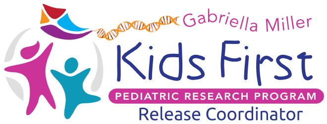

<p align="center">
  
</p>
<p align="center">
  <a herf="https://github.com/kids-first/kf-ui-release-coordinator/blob/master/LICENSE"></a>
  <a href="https://circleci.com/gh/kids-first/kf-ui-release-coordinator"></a>
</p>

Kids First Release Coordinator
==============================

## Development

Default configuration values are set in `.env`. Create overrides by in a 
`.env.local` file to configure as needed. The default values should be acceptable
for use with [kf-data-stack](https://github.com/kids-first/kf-data-stack)
to get up and running quickly. `REACT_APP_GOOGLE_APP_ID` will need to be
configured for proper authentication with ego. Make sure the Google app id
matches that for the running ego instance so that you may test authentication.

Once the dependent services are running, install and start:
```
yarn
yarn start
```
